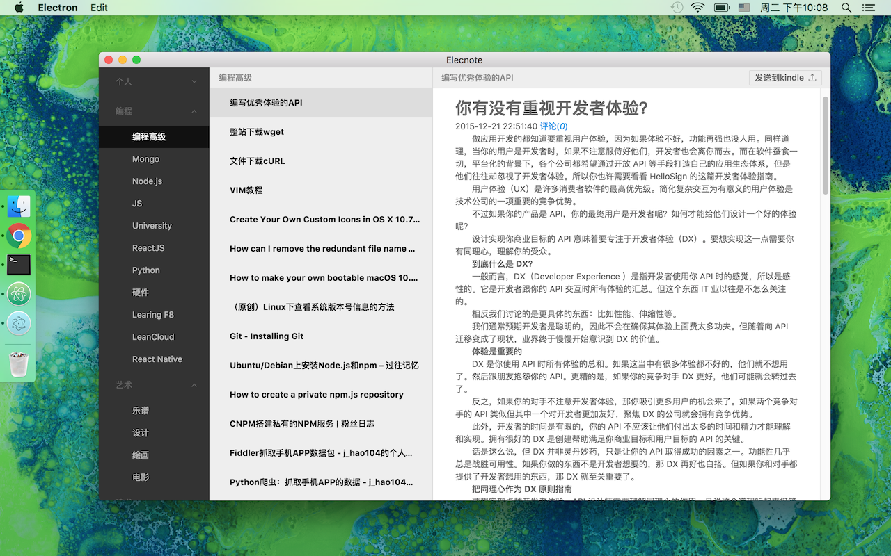
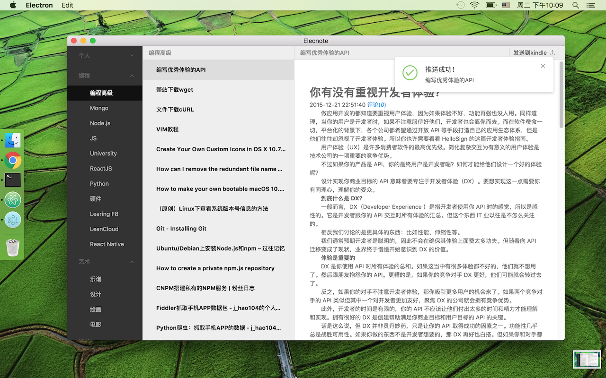

[中文]() | [英文]()

### 介绍
Elecnote是一款可以将笔记推送到**Kindle**上的**印象笔记**客户端。基于Electron、React开发。

### 预览
##### 主界面

##### 推送到Kindle成功


### 开发
```
git clone https://github.com/SherLuok/Elecnote.git
cd Elecnote
npm i
npm run watch
npm run app
```
